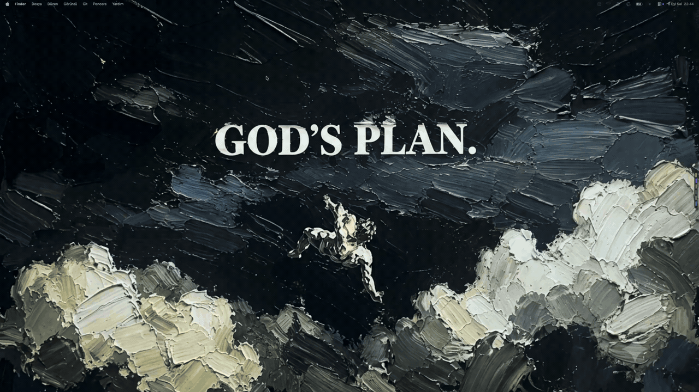
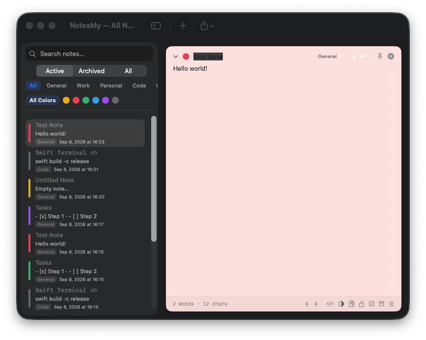
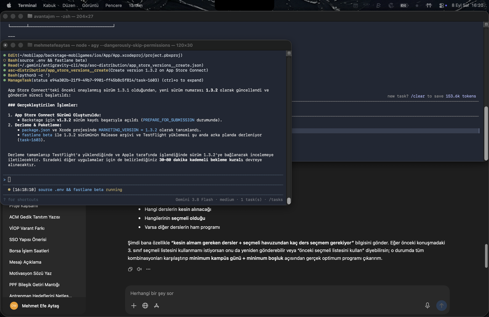
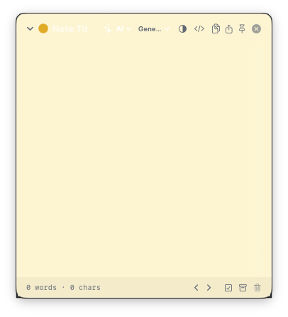

# 🧠 NotesMy

<p align="center">
  
</p>

<h2 align="center">Your AI-Powered Second Brain & Edge Sticky Notes for macOS</h2>

<p align="center">
  <strong>[🇬🇧 English](README.md)</strong> · 
  <a href="docs/README_tr.md">🇹🇷 Türkçe</a> · 
  <a href="docs/README_de.md">🇩🇪 Deutsch</a> · 
  <a href="docs/README_fr.md">🇫🇷 Français</a> · 
  <a href="docs/README_es.md">🇪🇸 Español</a> · 
  <a href="docs/README_pt.md">🇧🇷 Português</a> · 
  <a href="docs/README_it.md">🇮🇹 Italiano</a> · 
  <a href="docs/README_ru.md">🇷🇺 Русский</a> · 
  <a href="docs/README_ja.md">🇯🇵 日本語</a> · 
  <a href="docs/README_ko.md">🇰🇷 한국어</a> · 
  <a href="docs/README_ar.md">🇸🇦 العربية</a> · 
  <a href="docs/README_zh.md">🇨🇳 中文</a>
</p>

<p align="center">
  <a href="https://github.com/mehmetefeaytas/notesmy/releases"></a>
  <a href="https://github.com/mehmetefeaytas/homebrew-tap"></a>
  
  
  
  
  
</p>

---

## 🎬 Live Cinematic Demo

<p align="center">
  
</p>
<p align="center">
  <em>High-definition screen recording of NotesMy sliding smoothly from the screen edge, quick note captures, interactive sticky board, and instant OCR. (<a href="assets/demo.mp4">Download 60fps MP4</a>)</em>
</p>

---

## ⚡ What is NotesMy?

**NotesMy** is an ultra-fast, native macOS sticky notes and personal knowledge management application. It bridges the gap between quick scratchpads (like *Unclutter* and *SideNotes*) and deep knowledge bases (like *Obsidian* and *Apple Notes*).

Built 100% natively using **Swift 6, SwiftUI, and AppKit**, NotesMy stays out of your way in your menu bar and slides in gracefully from the screen edge whenever you summon it.

### ✨ Key Highlights

- 🪟 **Edge-Docked Deck:** Hover or gesture over the screen edge to reveal all your active notes in an animated, fanned-card dock.
- 🗑️ **Quick Delete & Inactive Notes Cleanup:** One-click instant deletion right on note cards, plus intelligent automated detection and archiving of stale notes unused for >30 days.
- ⚙️ **Safe Maintenance:** Safe window close handling (red close button never quits the app) and a two-stage confirmed data reset danger zone.
- 🧠 **AI Second Brain & Knowledge Graph:** Connect your thoughts using `[[WikiLinks]]`, chat conversationally with your notes collection, and explore your ideas on a 2D interactive force-directed graph.
- 🔍 **Screen OCR & Vision AI:** Snip any area of your display (crosshair selection) to extract clean text into your clipboard or note instantly.
- 🎙️ **On-Device Voice Transcription:** Real-time speech-to-text supporting 12 languages with zero latency and zero privacy risk.
- 📌 **Freeform Sticky Board:** Arrange notes as colorful sticky cards on an infinite zoomable, draggable corkboard canvas.
- 🎨 **Minimalist Pastel Palettes:** 6 carefully calibrated macOS pastel colors, rich markdown formatting, checklists, and code snippet highlighting.
- 🛡️ **Zero Telemetry & 100% Offline:** No tracking, no user profiling, no third-party cloud. All NLP and OCR models run strictly on Apple Silicon and Intel neural hardware.

---

## 🍺 Installation via Homebrew

The recommended way to install and stay updated on macOS:

```bash
# 1. Tap the custom Homebrew repository
brew tap mehmetefeaytas/tap

# 2. Install NotesMy
brew install --cask notesmy
```

### Upgrading
```bash
brew upgrade --cask notesmy
```

### Manual Download
Prefer a direct DMG download? Grab the latest Universal binary from [GitHub Releases](https://github.com/mehmetefeaytas/notesmy/releases/latest).

> **Gatekeeper Notice (First Launch):** Because NotesMy is currently distributed as an open-source binary, macOS may show a developer verification notice on first launch. Simply right-click `NotesMy.app` in `/Applications` and select **Open**, or run:
> ```bash
> xattr -cr /Applications/NotesMy.app
> ```

---

## 📸 Real Application Showcase

<table width="100%">
  <tr>
    <td width="50%">
      <h3 align="center">🗂️ All Notes & Semantic Search</h3>
      
    </td>
    <td width="50%">
      <h3 align="center">🪟 Screen-Edge Floating Deck</h3>
      
    </td>
  </tr>
  <tr>
    <td width="50%">
      <h3 align="center">📝 Minimalist Sticky Note Editor</h3>
      
    </td>
    <td width="50%">
      <h3 align="center">🎨 Modern Pastel Customization</h3>
      
    </td>
  </tr>
</table>

---

## 💎 Complete Feature Matrix

| Tier | Feature | Status | Technology |
| :--- | :--- | :---: | :--- |
| **V1 — MVP** | Text & Checklist Notes with custom pastel themes | ✅ | Native SwiftUI TextEditor |
| **V1 — MVP** | Edge-Docked Fanned Card Deck | ✅ | AppKit Floating NSPanel |
| **V1 — MVP** | Tags, Categories, Pinning & Favorites | ✅ | Local JSON Storage |
| **V1 — MVP** | Quick Delete on Card Rows | ✅ | Swift Action Handler |
| **V1 — MVP** | Clipboard History Hub (Auto-Capture) | ✅ | NSPasteboard Monitor |
| **V1 — MVP** | Interactive Color Picker & Resizable Windows | ✅ | AppKit NSWindow + SwiftUI |
| **V2 — Supercharged** | Multilingual Voice Notes (Speech-to-Text) | ✅ | Apple SFSpeechRecognizer |
| **V2 — Supercharged** | Vision OCR Text Extraction from Screen Snipping | ✅ | Apple Vision + screencapture |
| **V2 — Supercharged** | Interactive Freeform Sticky Board Canvas | ✅ | SwiftUI Drag & Drop Canvas |
| **V2 — Supercharged** | Inactive Notes (>30 Days) Cleanup & Archive | ✅ | Date-based Staleness Engine |
| **V2 — Supercharged** | Natural Language Smart Date & Reminder Alerts | ✅ | NSDataDetector + UserNotifications |
| **V2 — Supercharged** | Semantic Concept Vector Search | ✅ | Apple NaturalLanguage Embeddings |
| **V3 — Connected** | Web Clipper with Manual & Clipboard URL Fallback | ✅ | WebKit + URLSession |
| **V3 — Connected** | One-Click Calendar Integration (.ics) | ✅ | RFC 5545 Calendar Generator |
| **V3 — Connected** | Export to Apple Notes & Reminders | ✅ | NSSharingService + EventKit |
| **V3 — Connected** | CloudKit Private Database Sync & Local Backup | ✅ | Apple CloudKit Container |
| **V3 — Connected** | Note Version History & Time-Travel Restore | ✅ | Incremental Snapshots |
| **V4 — Second Brain** | Interactive Node Knowledge Graph with Search | ✅ | Graph Force Directed Layout |
| **V4 — Second Brain** | Bidirectional `[[WikiLinks]]` with Backlink Index | ✅ | Regex Link Parser |
| **V4 — Second Brain** | AI Chat with Your Notes Collection | ✅ | On-Device NaturalLanguage RAG |
| **V4 — Second Brain** | Smart Daily Plan & Action Item Extraction | ✅ | NLP Task Extraction |
| **V4 — Second Brain** | Messy Thought Cleanup & Auto-Formatting | ✅ | Apple Intelligence NLP Engine |

---

## 🌍 Supported Languages (12 Languages)

NotesMy automatically detects your macOS system language and includes full UI translations and voice transcription for:

| Flag | Language | Flag | Language | Flag | Language |
| :---: | :--- | :---: | :--- | :---: | :--- |
| 🇬🇧 | English | 🇹🇷 | Türkçe | 🇩🇪 | Deutsch |
| 🇫🇷 | Français | 🇪🇸 | Español | 🇧🇷 | Português (Brasil) |
| 🇮🇹 | Italiano | 🇷🇺 | Русский | 🇯🇵 | 日本語 |
| 🇰🇷 | 한국어 | 🇸🇦 | العربية (RTL) | 🇨🇳 | 简体中文 |

---

## ⌨️ Global Keyboard Shortcuts

All shortcuts can be customized from **Settings → Shortcuts**:

| Default Shortcut | Action | Description |
| :--- | :--- | :--- |
| `⌥⌘N` | **New Note** | Instantly spawns a floating sticky note on your active screen |
| `⌥⌘V` | **Quick Capture** | Converts clipboard contents into a new note |
| `⌥⌘L` | **All Notes & Search** | Opens main management window with semantic search |
| `⌥⌘B` | **Sticky Board** | Opens freeform visual corkboard canvas |
| `⌥⌘A` | **Archive** | Opens archived notes view |
| `⌃⌥⌘H` | **Toggle Deck** | Shows or hides screen-edge hover deck |
| `⌘[` / `⌘]` | **Cycle Notes** | Flips between previous and next notes |
| `Esc` | **Close Note** | Closes active floating note window |

---

## 📈 Star History

[](https://star-history.com/#mehmetefeaytas/notesmy&Date)

---

## 👥 Contributors

Contributions, feature suggestions, and bug reports are warmly welcome!

<a href="https://github.com/mehmetefeaytas/notesmy/graphs/contributors">
  
</a>

Please see [CONTRIBUTING.md](CONTRIBUTING.md) for contribution guidelines, branch conventions, and testing requirements.

---

## 💖 Sponsors & Support

If NotesMy saves you time and streamlines your macOS workflow, please consider sponsoring development or buying a coffee!

<p align="center">
  <a href="https://github.com/sponsors/mehmetefeaytas"></a>
  &nbsp;&nbsp;
  <a href="https://buymeacoffee.com/mehmetefeaytas"></a>
</p>

---

## 📬 Contact & Connect

Feel free to reach out for feedback, collaborations, or questions:

- 📧 **Email:** [efeyapiyor@gmail.com](mailto:efeyapiyor@gmail.com)
- 💼 **LinkedIn:** [Mehmet Efe Aytaş](https://linkedin.com/in/mehmetefeaytas)
- 🐙 **GitHub:** [@mehmetefeaytas](https://github.com/mehmetefeaytas)

---

## 🛡️ Privacy & Architecture

- **Zero Network Dependency:** NotesMy works 100% offline. No third-party servers, no analytics, no user tracking.
- **Local File Storage:** Notes are stored cleanly in `~/Library/Application Support/NotesMy/notes.json` with human-readable Markdown export.
- **CloudKit Sync:** Optional synchronization runs exclusively through your personal private iCloud account container.

---

## 📄 License

NotesMy is licensed under the **Apache License 2.0**. See the [LICENSE](LICENSE) file for details.

Developed with ❤️ by **[Mehmet Efe Aytaş](https://github.com/mehmetefeaytas)**.
