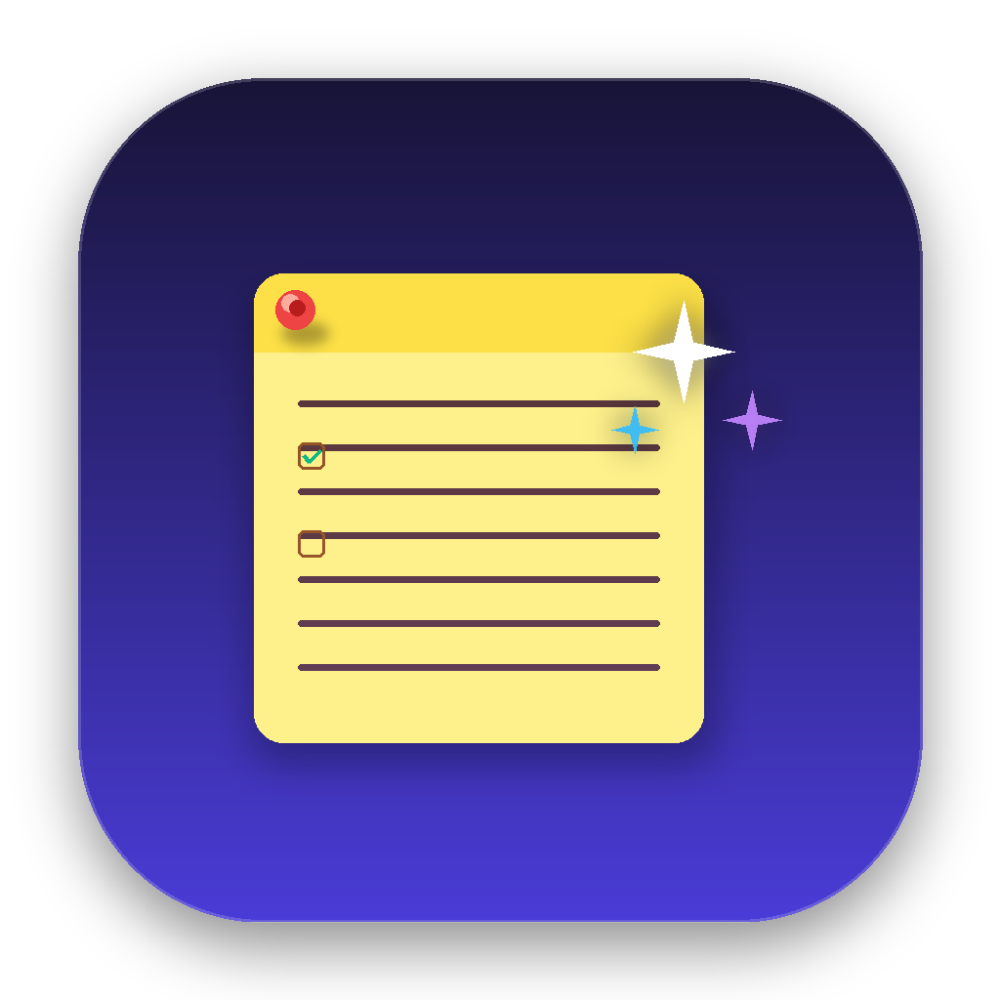
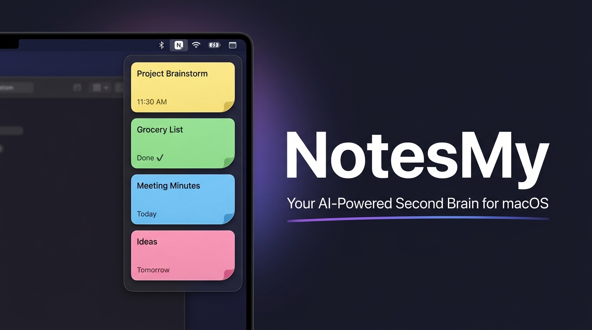
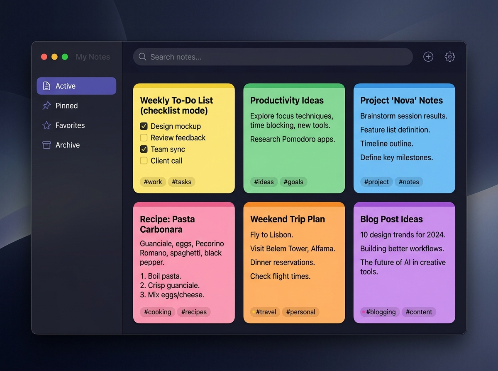
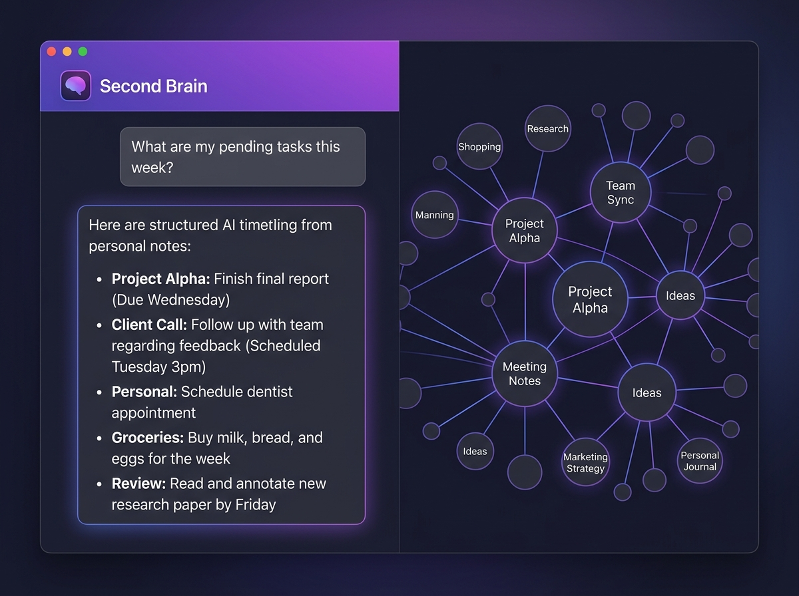
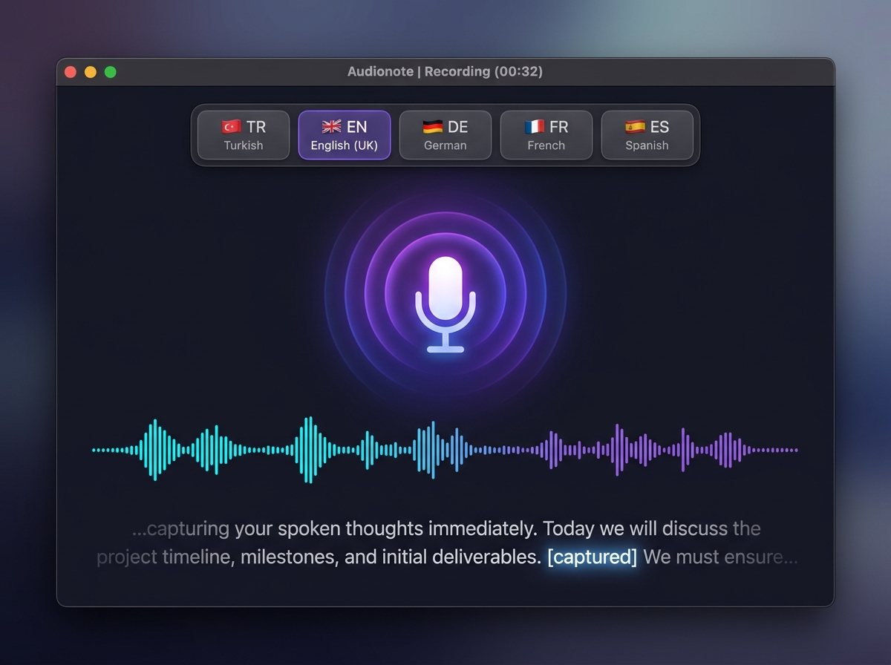
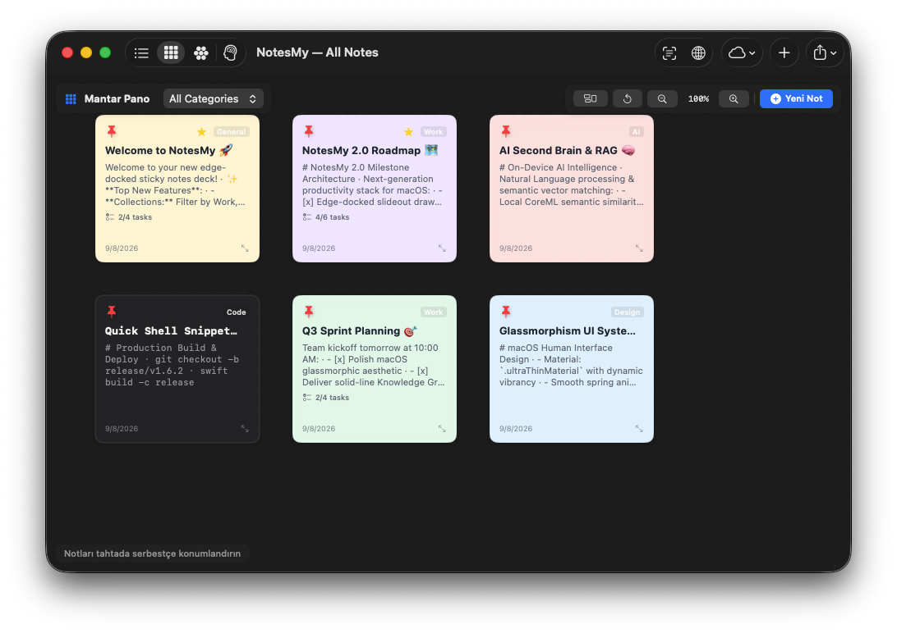

# 🧠 NotesMy

<p align="center">
  
</p>

<h2 align="center">Your AI-Powered Second Brain & Edge Sticky Notes for macOS</h2>

<p align="center">
  <strong>[🇬🇧 English](README.md)</strong> · 
  <a href="docs/README_tr.md">🇹🇷 Türkçe</a> · 
  <a href="docs/README_de.md">🇩🇪 Deutsch</a> · 
  <a href="docs/README_fr.md">🇫🇷 Français</a> · 
  <a href="docs/README_es.md">🇪🇸 Español</a> · 
  <a href="docs/README_pt.md">🇧🇷 Português</a> · 
  <a href="docs/README_it.md">🇮🇹 Italiano</a> · 
  <a href="docs/README_ru.md">🇷🇺 Русский</a> · 
  <a href="docs/README_ja.md">🇯🇵 日本語</a> · 
  <a href="docs/README_ko.md">🇰🇷 한국어</a> · 
  <a href="docs/README_ar.md">🇸🇦 العربية</a> · 
  <a href="docs/README_zh.md">🇨🇳 中文</a>
</p>

<p align="center">
  <a href="https://github.com/mehmetefeaytas/notesmy/releases"></a>
  <a href="https://github.com/mehmetefeaytas/homebrew-tap"></a>
  
  
  
  
  
</p>

<p align="center">
  
</p>

---

## ⚡ What is NotesMy?

**NotesMy** combines the speed of screen-edge scratchpads (like *Unclutter* and *SideNotes*) with the cognitive power of modern Personal Knowledge Management systems (like *Obsidian* and *Apple Intelligence*). 

Built 100% natively using **Swift 6, SwiftUI, and AppKit**, NotesMy runs unobtrusively in your menu bar and slides in gracefully from the screen edge whenever you need it.

---

## 🍺 Installation via Homebrew

The recommended way to install and stay updated on macOS:

```bash
# 1. Tap the custom Homebrew repository
brew tap mehmetefeaytas/tap

# 2. Install NotesMy
brew install --cask notesmy
```

### Upgrading
```bash
brew upgrade --cask notesmy
```

### Manual Download
Prefer a direct DMG download? Grab the latest Universal binary from [GitHub Releases](https://github.com/mehmetefeaytas/notesmy/releases/latest).

> **Gatekeeper Notice (First Launch):** Because NotesMy is currently distributed as an open-source binary, macOS may show a developer verification notice on first launch. Simply right-click `NotesMy.app` in `/Applications` and select **Open**, or run:
> ```bash
> xattr -cr /Applications/NotesMy.app
> ```

---

## 📸 Feature Showcase

<table width="100%">
  <tr>
    <td width="50%">
      <h3 align="center">🗂️ Edge-Docked & Categorized Notes</h3>
      
    </td>
    <td width="50%">
      <h3 align="center">🧠 AI Second Brain & Knowledge Graph</h3>
      
    </td>
  </tr>
  <tr>
    <td width="50%">
      <h3 align="center">🎙️ Multilingual Speech-to-Text</h3>
      
    </td>
    <td width="50%">
      <h3 align="center">📌 Freeform Sticky Board Canvas</h3>
      
    </td>
  </tr>
</table>

---

## 💎 Complete Feature Matrix

| Tier | Feature | Status | Technology |
| :--- | :--- | :---: | :--- |
| **V1 — MVP** | Text & Checklist Notes with custom pastel themes | ✅ | Native SwiftUI TextEditor |
| **V1 — MVP** | Edge-Docked Fanned Card Deck | ✅ | AppKit Floating NSPanel |
| **V1 — MVP** | Tags, Categories, Pinning & Favorites | ✅ | Local JSON Storage |
| **V1 — MVP** | Clipboard History Hub (Auto-Capture) | ✅ | NSPasteboard Monitor |
| **V1 — MVP** | Interactive Color Picker & Resizable Windows | ✅ | AppKit NSWindow + SwiftUI |
| **V2 — Supercharged** | Multilingual Voice Notes (Speech-to-Text) | ✅ | Apple SFSpeechRecognizer |
| **V2 — Supercharged** | Vision OCR Text Extraction from Screenshots | ✅ | Apple Vision Framework |
| **V2 — Supercharged** | Interactive Freeform Sticky Board Canvas | ✅ | SwiftUI Drag & Drop Canvas |
| **V2 — Supercharged** | Apple Pencil & Mouse Freehand Sketching | ✅ | AppKit NSBezierPath Engine |
| **V2 — Supercharged** | Natural Language Smart Date & Reminder Alerts | ✅ | NSDataDetector + UserNotifications |
| **V2 — Supercharged** | Semantic Concept Vector Search | ✅ | Apple NaturalLanguage Embeddings |
| **V3 — Connected** | Web Clipper from Clipboard URL | ✅ | WebKit + URLSession |
| **V3 — Connected** | One-Click Calendar Integration (.ics) | ✅ | RFC 5545 Calendar Generator |
| **V3 — Connected** | Export to Apple Notes & Reminders | ✅ | NSSharingService + EventKit |
| **V3 — Connected** | CloudKit Private Database Sync | ✅ | Apple CloudKit Container |
| **V3 — Connected** | Note Version History & Time-Travel Restore | ✅ | Incremental Snapshots |
| **V4 — Second Brain** | Interactive Node Knowledge Graph | ✅ | Graph Force Directed Layout |
| **V4 — Second Brain** | Bidirectional `[[WikiLinks]]` with Backlink Index | ✅ | Regex Link Parser |
| **V4 — Second Brain** | AI Chat with Your Notes Collection | ✅ | On-Device NaturalLanguage RAG |
| **V4 — Second Brain** | Smart Daily Plan & Action Item Extraction | ✅ | NLP Task Extraction |
| **V4 — Second Brain** | Messy Thought Cleanup & Auto-Formatting | ✅ | Apple Intelligence NLP Engine |

---

## 🌍 Supported Languages (12 Languages)

NotesMy automatically detects your macOS system language and includes full UI translations and voice transcription for:

| Flag | Language | Flag | Language | Flag | Language |
| :---: | :--- | :---: | :--- | :---: | :--- |
| 🇬🇧 | English | 🇹🇷 | Türkçe | 🇩🇪 | Deutsch |
| 🇫🇷 | Français | 🇪🇸 | Español | 🇧🇷 | Português (Brasil) |
| 🇮🇹 | Italiano | 🇷🇺 | Русский | 🇯🇵 | 日本語 |
| 🇰🇷 | 한국어 | 🇸🇦 | العربية (RTL) | 🇨🇳 | 简体中文 |

---

## ⌨️ Global Keyboard Shortcuts

All shortcuts can be customized from **Settings → Shortcuts**:

| Default Shortcut | Action | Description |
| :--- | :--- | :--- |
| `⌥⌘N` | **New Note** | Instantly spawns a floating sticky note on your active screen |
| `⌥⌘V` | **Quick Capture** | Converts clipboard contents into a new note |
| `⌥⌘L` | **All Notes & Search** | Opens main management window with semantic search |
| `⌥⌘B` | **Sticky Board** | Opens freeform visual corkboard canvas |
| `⌥⌘A` | **Archive** | Opens archived notes view |
| `⌃⌥⌘H` | **Toggle Deck** | Shows or hides screen-edge hover deck |
| `⌘[` / `⌘]` | **Cycle Notes** | Flips between previous and next notes |
| `Esc` | **Close Note** | Closes active floating note window |

---

## 🤝 Contributing & Maintainer Policy

We welcome community feedback, pull requests, and bug reports!

> [!IMPORTANT]
> **Release Authority:** The release pipeline, DMG packaging, and Homebrew tap deployments are strictly maintainer-only and restricted to [@mehmetefeaytas](https://github.com/mehmetefeaytas).
>
> Please read our [**CONTRIBUTING.md**](CONTRIBUTING.md) for branch naming rules (`feature/*`, `fix/*`), Conventional Commits requirements, and local testing verification steps before submitting PRs.

---

## 🛡️ Privacy & Architecture

- **Zero Network Dependency:** NotesMy works 100% offline. No third-party servers, no analytics, no user tracking.
- **Local File Storage:** Notes are stored cleanly in `~/Library/Application Support/NotesMy/notes.json` with human-readable Markdown export.
- **CloudKit Sync:** Optional synchronization runs exclusively through your personal private iCloud account container.

---

## 📄 License

NotesMy is licensed under the **Apache License 2.0**. See the [LICENSE](LICENSE) file for details.

Developed with ❤️ by **[Mehmet Efe Aytaş](https://github.com/mehmetefeaytas)**.
