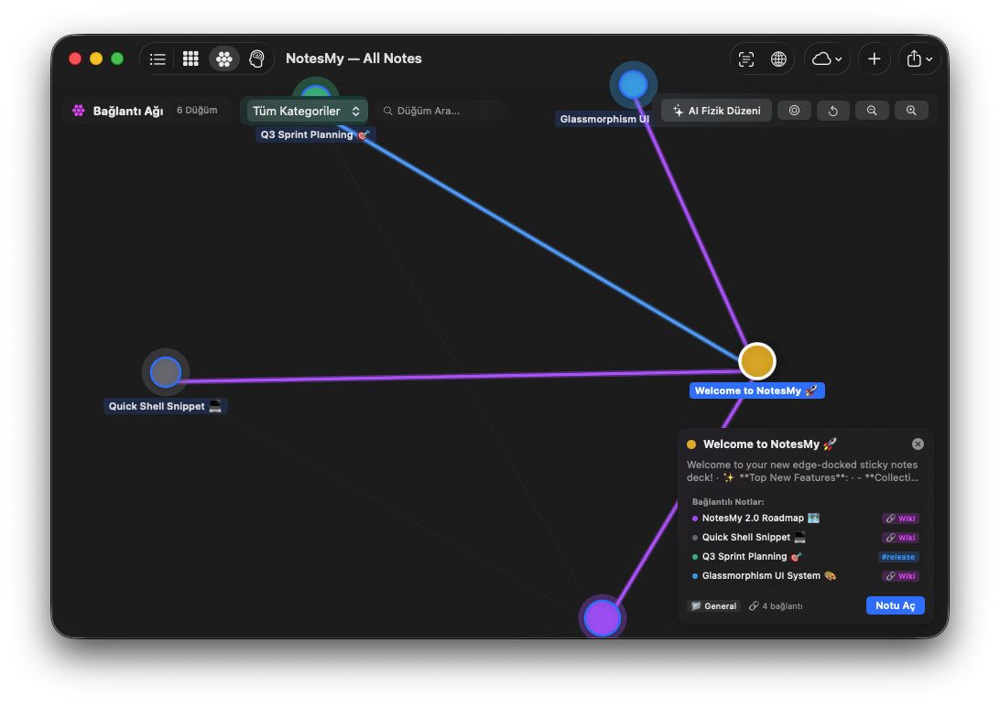

# 🇨🇳 NotesMy — 专为 macOS 打造的 AI 第二大脑与屏幕边缘便利贴

<p align="center">
  
</p>

<h2 align="center">无缝贴靠屏幕边缘的灵动便利贴 · 本地化个人知识管理系统</h2>

<p align="center">
  <a href="../README.md">🇬🇧 English</a> · 
  <a href="README_tr.md">🇹🇷 Türkçe</a> · 
  <a href="README_de.md">🇩🇪 Deutsch</a> · 
  <a href="README_fr.md">🇫🇷 Français</a> · 
  <a href="README_es.md">🇪🇸 Español</a> · 
  <a href="README_pt.md">🇧🇷 Português</a> · 
  <a href="README_it.md">🇮🇹 Italiano</a> · 
  <a href="README_ru.md">🇷🇺 Русский</a> · 
  <a href="README_ja.md">🇯🇵 日本語</a> · 
  <a href="README_ko.md">🇰🇷 한국어</a> · 
  <a href="README_ar.md">🇸🇦 العربية</a> · 
  <strong>[🇨🇳 中文](README_zh.md)</strong>
</p>

<p align="center">
  <a href="https://github.com/mehmetefeaytas/notesmy/releases"></a>
  <a href="https://github.com/mehmetefeaytas/homebrew-tap"></a>
  
  
  
  
  
</p>

---

## 🎬 动态演示

<p align="center">
  
</p>
<p align="center">
  <em>高清实录演示：从屏幕边缘顺滑展开卡片抽屉、极速记录灵感、自由便利贴软木板与即时 OCR 文字提取。（<a href="../assets/demo.mp4">下载 60fps 高清 MP4</a>）</em>
</p>

---

## ⚡ 什么是 NotesMy？

**NotesMy** 是一款专为 macOS 打造的高性能原生笔记与个人知识管理（PKM）工具。它将屏幕侧边便利贴（如 *Unclutter*、*SideNotes*）的轻盈随手记与双链知识图谱（如 *Obsidian*、*Apple Notes*）的深度思维有机结合。

100% 基于 **Swift 6、SwiftUI 与 AppKit** 原生开发，NotesMy 隐身于系统菜单栏中，当光标移至屏幕边缘或按下快捷键时即可优雅滑出，不打扰您的沉浸工作流。

### ✨ 核心特性

- 🪟 **边缘折叠卡片抽屉（Edge Deck）：** 将鼠标移动至屏幕边缘，即可扇形展开当前所有活跃笔记卡片。
- 🔄 **应用内自动检查更新：** 在设置中直接检测 GitHub Releases 最新版本、阅读版本更新日志、查看 DMG 下载进度条，并支持一键更新。
- ⌨️ **方向键类别横向浏览：** 支持通过键盘左右方向键（`←` / `→`）及左右切换按钮平滑横向滚动与切换分类标签。
- 🗑️ **卡片快捷删除与闲置笔记归档：** 支持在笔记卡片上一键极速删除；智能检测并提示归档超过 30 天未修改的陈旧笔记。
- ⚙️ **安全窗口保护机制：** 关闭设置窗口的红叉绝不退出应用后台；两阶段确认对话框防止误清空数据。
- 🧠 **物理学 AI 知识图谱：** 基于库仑-胡克引力斥力物理学仿真、Jaccard 概念语义关联、双向 `[[WikiLinks]]`，在选中节点时以鲜艳高亮实线呈现紧密关联。
- 🔍 **屏幕截图 OCR 文字识别：** 十字准星框选屏幕任意区域，通过 Apple Vision 毫秒级提取文本至剪贴板或笔记中。
- 🎙️ **设备端多语言语音转文字：** 依托 Apple Silicon 神经引擎，实时听写转录 12 种语言，零网络延迟，严密保护个人隐私。
- 📌 **无限自由软木板（Sticky Board）：** 在可缩放、可自由拖拽的无限画布上，任意排布如彩色便签一般的灵感卡片。
- 🎨 **极简莫兰迪马卡龙配色：** 6 种经过精准校准的 macOS 柔和色系，支持 Markdown 富文本排版、待办清单与代码高亮。
- 🛡️ **无任何埋点遥测 · 100% 离线可用：** 无需注册账号，无任何云端数据回传。所有 AI 自然语言模型完全在 Mac 本地安全运行。

---

## 🍺 通过 Homebrew 安装

macOS 用户推荐使用 Homebrew 进行安装与更新：

```bash
# 1. 添加软件源
brew tap mehmetefeaytas/tap

# 2. 安装 NotesMy
brew install --cask notesmy
```

### 检查并升级
```bash
brew upgrade --cask notesmy
```

### 手动安装（DMG）
如需直接下载 Universal DMG 安装包，请访问 [GitHub Releases](https://github.com/mehmetefeaytas/notesmy/releases/latest) 获取最新发布版本。

> **Gatekeeper 提示（首次打开）：** 由于属于独立开源分发，macOS 可能会提示“无法验证开发者”。只需在“访达”的 `/Applications` 文件夹中右键点击 `NotesMy.app` 并选择 **打开**，或在终端中执行：
> ```bash
> xattr -cr /Applications/NotesMy.app
> ```

---

## 📸 应用实机截图

<table width="100%">
  <tr>
    <td width="50%">
      <h3 align="center">🕸️ AI 知识图谱与发光连线</h3>
      
    </td>
  </tr>
</table>

---

## 💎 全功能演进矩阵

| 阶段 | 功能特性 | 状态 | 技术方案 |
| :--- | :--- | :---: | :--- |
| **V1 — 核心基石** | 柔和马卡龙色系文本与待办列表笔记 | ✅ | 原生 SwiftUI TextEditor |
| **V1 — 核心基石** | 靠泊屏幕边缘的扇形展开卡片抽屉 | ✅ | AppKit 浮动 NSPanel |
| **V1 — 核心基石** | 标签、分类、置顶与收藏星标系统 | ✅ | 本地 JSON 结构化存储 |
| **V1 — 核心基石** | 方向键（`←` / `→`）横向快速遍历分类 | ✅ | AppKit Event Monitor + ScrollViewReader |
| **V1 — 核心基石** | 卡片悬浮一键极速删除 | ✅ | Swift Action Handler |
| **V1 — 核心基石** | 剪贴板历史自动捕获中枢 | ✅ | NSPasteboard 变更监听 |
| **V1 — 核心基石** | 交互式调色板与多级窗口缩放 | ✅ | AppKit NSWindow + SwiftUI |
| **V2 — 超级提速** | 12 种语言实时语音转文字听写 | ✅ | Apple SFSpeechRecognizer |
| **V2 — 超级提速** | 屏幕框选即刻 OCR 文字识别提取 | ✅ | Apple Vision + screencapture |
| **V2 — 超级提速** | 自由排布的无限便签白板（Corkboard） | ✅ | SwiftUI 拖放交互画布 |
| **V2 — 超级提速** | 30 天以上闲置笔记自动清理归档 | ✅ | 基于时间戳的活跃度检测器 |
| **V2 — 超级提速** | 自然语言智能日期识别与提醒同步 | ✅ | NSDataDetector + UserNotifications |
| **V2 — 超级提速** | 语义概念向量化向量搜索 | ✅ | Apple NaturalLanguage 词嵌入 |
| **V3 — 生态互联** | 内置自动更新检测与 GitHub 版本联动 | ✅ | GitHub REST API + URLSession |
| **V3 — 生态互联** | 网页剪藏器（Web Clipper）提取摘要 | ✅ | WebKit + URLSession |
| **V3 — 生态互联** | 一键导出标准日历行程（.ics） | ✅ | RFC 5545 标准日历构建器 |
| **V3 — 生态互联** | 快速导出至 Apple 备忘录与提醒事项 | ✅ | NSSharingService + EventKit |
| **V3 — 生态互联** | 私有 CloudKit 数据库云同步与本地备份 | ✅ | Apple CloudKit 容器 |
| **V3 — 生态互联** | 笔记版本历史追溯与时间机器还原 | ✅ | 增量快照序列化 |
| **V4 — 第二大脑** | 库仑-胡克引力斥力物理模型 AI 知识图谱 | ✅ | 数学物理引擎仿真 + Canvas |
| **V4 — 第二大脑** | 选中节点时鲜艳实线高亮连接网络 | ✅ | SwiftUI 矢量矢量路径渲染 |
| **V4 — 第二大脑** | 双向 `[[WikiLinks]]` 与反向链接索引 | ✅ | 正则表达式解析器 |
| **V4 — 第二大脑** | 基于全部笔记知识库的本地端 AI 对话 | ✅ | 本地 NaturalLanguage RAG 架构 |
| **V4 — 第二大脑** | 智能今日行动计划生成与待办提炼 | ✅ | 自然语言任务挖掘模型 |
| **V4 — 第二大脑** | 杂乱思绪梳理与自动结构化排版 | ✅ | Apple Intelligence NLP 引擎 |

---

## 🌍 支持的语言（共 12 种语言）

NotesMy 可自动适配您的 macOS 系统语言，并在以下语言环境中提供完整的 UI 交互与语音听写支持：

| 国旗 | 语言 | 国旗 | 语言 | 国旗 | 语言 |
| :---: | :--- | :---: | :--- | :---: | :--- |
| 🇬🇧 | English | 🇹🇷 | Türkçe | 🇩🇪 | Deutsch |
| 🇫🇷 | Français | 🇪🇸 | Español | 🇧🇷 | Português (巴西) |
| 🇮🇹 | Italiano | 🇷🇺 | Русский | 🇯🇵 | 日本語 |
| 🇰🇷 | 한국어 | 🇸🇦 | العربية (RTL) | 🇨🇳 | 简体中文 |

---

## ⌨️ 全局快捷键指南

所有快捷键均可在 **设置 → 快捷键** 中进行自定义配置：

| 默认快捷键 | 功能 | 描述说明 |
| :--- | :--- | :--- |
| `⌥⌘N` | **新建笔记** | 在当前屏幕上方立即弹出独立的浮动便利贴 |
| `⌥⌘V` | **快速抓取** | 将剪贴板当前复制的文本快速转化为新笔记 |
| `⌥⌘L` | **全部笔记与搜索** | 唤出主管理视窗并进行全文及语义搜索 |
| `⌥⌘B` | **便签画板** | 打开无限画布软木板 |
| `⌥⌘A` | **归档列表** | 查看已归档的历史笔记 |
| `⌃⌥⌘H` | **切换侧边抽屉** | 显示或隐藏贴合屏幕边缘的卡片抽屉 |
| `Esc` | **关闭笔记** | 关闭当前处于焦点的笔记编辑窗口 |

---

## 📈 关注度与 Star 历史

[](https://star-history.com/#mehmetefeaytas/notesmy&Date)

---

## 👥 贡献者名单

非常欢迎来自社区的 Issue 反馈、功能提议与代码贡献！

<a href="https://github.com/mehmetefeaytas/notesmy/graphs/contributors">
  
</a>

提交代码前请先查阅 [CONTRIBUTING.md](../CONTRIBUTING.md) 了解代码规范与测试要求。

---

## 💖 赞助与支持

如果 NotesMy 提升了您在 Mac 上的生产力，欢迎赞助项目或请作者喝一杯咖啡：

<p align="center">
  <a href="https://github.com/sponsors/mehmetefeaytas"></a>
</p>

---

## 📬 交流与联系

欢迎随时交流讨论与商务合作：

- 📧 **邮箱：** [efeyapiyor@gmail.com](mailto:efeyapiyor@gmail.com)
- 💼 **LinkedIn：** [Mehmet Efe Aytaş](https://linkedin.com/in/mehmetefeaytas)
- 🐙 **GitHub：** [@mehmetefeaytas](https://github.com/mehmetefeaytas)

---

## 🛡️ 隐私与技术架构

- **100% 离线运作：** NotesMy 不依赖外部服务器，不包含任何数据埋点或用户行为追踪。
- **透明的本地文件存储：** 所有笔记清晰保存在 `~/Library/Application Support/NotesMy/notes.json` 中。
- **CloudKit 私有云：** 若开启同步，数据仅通过您私人的 Apple iCloud 容器安全传输，第三方无权窥探。

---

## 📄 开源许可证

NotesMy 基于 **Apache License 2.0** 许可证开源发布。更多详情请参阅 [LICENSE](../LICENSE) 文件。

由 **[Mehmet Efe Aytaş](https://github.com/mehmetefeaytas)** 倾注 ❤️ 精心打造。
